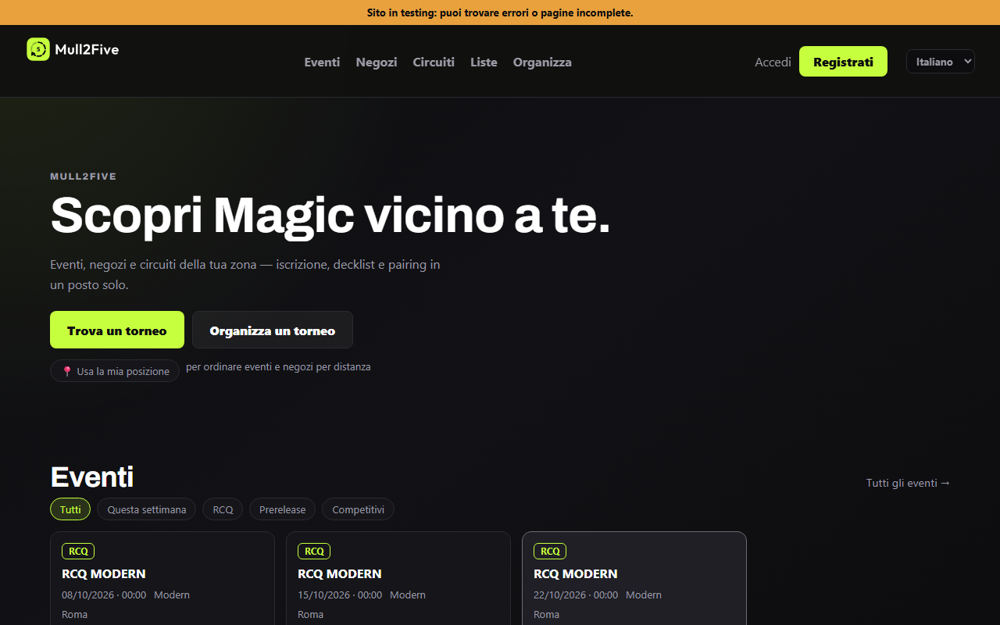
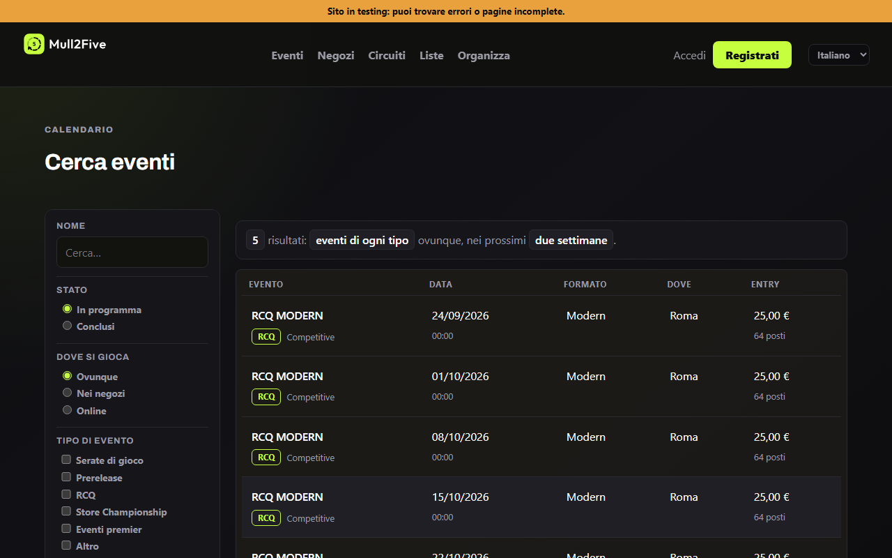
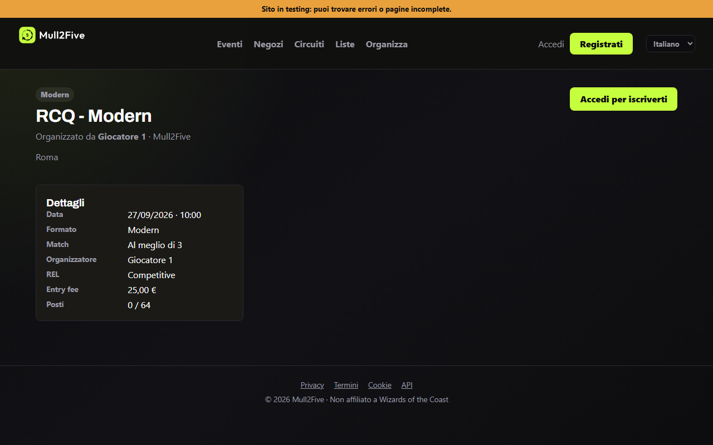

<div align="center">

# Mull2Five

**Piattaforma per tornei di carte: ricerca eventi, iscrizioni, pagamenti, turni, abbinamenti e liste dei mazzi.**

[](https://mull2five.onrender.com)
[](docs/README.md)

[](#stato)
[](SECURITY.md)
[](LICENSE)

<table>
  <tr>
    <td width="33%"></td>
    <td width="33%"></td>
    <td width="33%"></td>
  </tr>
  <tr>
    <td align="center"><sub>Scopri</sub></td>
    <td align="center"><sub>Cerca eventi</sub></td>
    <td align="center"><sub>Pagina del torneo</sub></td>
  </tr>
</table>

<sub>Schermate prese dallo staging, dove i dati sono anonimizzati: i nomi non sono di persone vere.</sub>

</div>

> [!IMPORTANT]
> **Il servizio è in prova, non ancora aperto ai negozi.** Su
> `mull2five.onrender.com` gira una versione di collaudo: pagamenti simulati,
> dati di prova, e chi si registra può scegliersi il ruolo. Il primo caricamento
> è lento perché il piano gratuito addormenta il servizio.

> [!NOTE]
> Il codice è leggibile, ma **non è software libero**: nessuna licenza d'uso è
> concessa, vedi [LICENSE](LICENSE). Mull2Five non è affiliato, approvato né
> sponsorizzato da Wizards of the Coast LLC. Magic: The Gathering e i marchi
> collegati appartengono a Wizards of the Coast LLC; questo progetto non
> distribuisce immagini di carte.

## Indice

- [Stato](#stato)
- [Funzionalità](#funzionalità)
- [Architettura](#architettura)
- [Avvio rapido](#avvio-rapido)
- [Test](#test)
- [Struttura del progetto](#struttura-progetto)
- [Configurazione](#configurazione)
- [Come funziona il sito](#come-funziona-il-sito)
- [Convenzioni del codice](#convenzioni-del-codice)

## Stato

Due ambienti, stessa immagine, database separati:

| | Ramo | A cosa serve |
|---|---|---|
| **Produzione** | `main` | il sito di collaudo, aperto a chi ha il link |
| **Staging** | `develop` | le prove, con una copia anonimizzata dei dati |

Si lavora su `develop`, si guarda lo staging, si fonde in `main`. `/health` dice
quale commit sta girando e se lo schema è allineato al codice. Dettagli in
[docs/hosting.md](docs/hosting.md).

Cosa manca prima di aprire ai negozi: verifica legale di privacy e termini,
Stripe Connect sull'account vero, un piano Render che non si addormenti, e la
firma del webhook PayPal. Elenco completo in [TODO.md](TODO.md).

## Brand

Palette: lime `#c6ff3d`, nero `#0d0d0f`, bianco. Gli asset stanno in
`frontend/public/` (favicon, icone PWA, anteprima social) e `frontend/public/brand/`
(logo orizzontale per l'header, verticale per il login, badge per gli spazi stretti).
Il nome si scrive sempre `Mull2Five`.

## Funzionalità

App **interamente online** (tutto passa dal backend, niente localStorage): accessibile
da più PC contemporaneamente, pensata anche per tornei grandi.

### Giocatori
- Home "Scopri": rail per eventi, negozi e circuiti con filtri rapidi
- Ricerca eventi a facet: tipo evento, formati multipli, REL, periodo, distanza in km, ricerche salvate
- Profili negozio e pagine circuito pubbliche, con classifica e soglia di qualificazione
- Iscrizione + pagamento obbligatorio (Stripe/PayPal/sandbox)
- "Le mie iscrizioni": pairings, risultati, decklist self-service, QR check-in, storico tornei
- Notifiche Web Push (annunci, nuovo round) + profilo pubblico condivisibile
- Interfaccia bilingue IT/EN

### Organizzatori
- Back-office (`organizer.html`): tornei, iscritti, liste, annunci, penalità, classifica, report
- Console Regia (`control.html`): timer round (restart/extend), +min per tavolo, risultati, genera round, vista judge
- Schermi condivisibili full-screen: `timer.html?t=ID`, `display.html?t=ID` (TV negozio)
- Pairing svizzero, Top 8 bracket, multi-tenant (più negozi)

### Infrastruttura
- Redis (cache + lockout), Web Push (VAPID), Prometheus `/metrics`, alerting email/Telegram + watchdog DB
- Schema descritto dai modelli e aggiornato da Alembic all'avvio, backup PostgreSQL cifrati ogni notte (GitHub Actions)
- Rate limiting (slowapi), account lockout, JWT expiry, CSP headers
- GitHub Actions CI/CD; test: pytest (backend) + Vitest + Playwright E2E

---

## Architettura

**Un solo frontend online** in `frontend/` (Vite multi-page). In produzione la build
(`frontend/dist`) la serve lo stesso processo FastAPI dell'API, su `/`; l'API sta su `/api`.
Il vecchio organizer tool offline (localStorage) è stato rimosso: ogni funzione passa
ora dal backend ed è accessibile da qualunque dispositivo.

---

## Avvio rapido

Il modo più comune in sviluppo: backend in WSL, Vite su Windows.

**Terminale 1 — backend (WSL):**
```bash
cp .env.example .env   # solo la prima volta
./scripts/dev.sh
```

**Terminale 2 — frontend (Windows):**
```bash
cd frontend
npm install            # solo la prima volta
npm run dev            # apre http://localhost:5173
```

> Il proxy Vite inoltra automaticamente `/api` e `/health` al backend su `127.0.0.1:8000`.
> Nessuna configurazione CORS necessaria in sviluppo.

---

## Comandi frontend (npm)

> Tutti i comandi npm vanno eseguiti da `frontend/` oppure con `make fe-*` dalla root.

| Comando | Da `frontend/` | Dalla root |
|---|---|---|
| Dev server | `npm run dev` | `make fe-dev` |
| Build produzione | `npm run build` | `make fe-build` |
| Anteprima build | `npm run preview` | — |
| Test unit (watch) | `npm run test` | `make fe-test` |
| Test unit (una volta) | `npm run test:run` | `make fe-test-run` |
| Test unit con coverage | `npm run test:cover` | — |
| E2E test | `npm run e2e` | — |
| E2E con UI interattiva | `npm run e2e:ui` | — |
| Installa browser Playwright | `npm run e2e:install` | — |

---

## Comandi backend (Python / WSL)

| Comando | Descrizione |
|---|---|
| `./scripts/dev.sh` | Installa dipendenze e avvia uvicorn con reload |
| `make dev` | Alias per `dev.sh` |
| `make install` | Solo installazione dipendenze |
| `make lint` | Linting con ruff |
| `make test` | Test suite Python |
| `docker compose up --build` | Avvio completo con PostgreSQL |
| `docker compose down` | Spegni i container |

---

## Test

### Frontend (Vitest)

```bash
cd frontend   # tutti i comandi npm si eseguono da qui

# Una volta sola
npm run test:run

# Modalità watch (riesegue al salvataggio)
npm run test

# Con report coverage
npm run test:cover
```

I test vivono in `tests/` e coprono:

| File | Cosa testa |
|---|---|
| `tests/utils.test.js` | `invertResult`, `parseDeck` (duplicati, Commander), `haversine`, `Paginator`, `escapeHtml`, `storageKB` |
| `tests/state.test.js` | `computeStandings`, `swissPairing`, `isRoundComplete`, `getResultObj` (retrocompat) |
| `tests/auth.test.js` | `registerUser`, `loginUser`, `startSession`, `isOrganizer` |
| `tests/round.test.js` | Coerenza risultati pair[0]/pair[1], lock giocatore, formato stringa |
| `tests/search.test.js` | `filterEventsSync` (nome, formato, data, venue, raggio), edge cases deck parser |

### Backend (Python)

```bash
# Dalla root del progetto (venv attivo)
python -m unittest discover -s tests -v

# Oppure con make
make test
```

---

## Struttura Progetto

```text
.
├── backend/app/
│   ├── routers/          # auth, tournaments, events, tags, organizations, payments, push, seasons, admin
│   ├── services/         # email, notifiche, pagamenti, decklist, oauth, avvisi all'organizzatore
│   └── core/             # config, rate limit, lockout, cache/Redis, monitoring, tenant, web push
├── frontend/             # Vite multi-page; in produzione lo serve il backend
│   ├── js/               # un modulo per pagina, più i condivisi:
│   │                     #   catalog.js (schede e vocabolario), escape.js (escape HTML),
│   │                     #   console.js (Regia), deck-view.js (lista grafica), push.js
│   ├── public/           # brand/, icone, site.webmanifest, sw.js
│   ├── tests/            # Vitest
│   ├── e2e/              # Playwright
│   └── *.html            # una pagina per sezione
├── tests/                # pytest; tests/load/ per i test di carico (Locust)
├── scripts/              # dev.sh, dati di prova
├── docs/                 # cosa fa ogni schermata, e la messa online
├── .github/workflows/    # CI e backup notturno cifrato
├── Dockerfile            # immagine unica: build del frontend + backend
└── docker-compose.yml    # PostgreSQL e Redis in locale
```

---

## Configurazione

Copia `.env.example` in `.env` e modifica i valori necessari.

**Sviluppo locale (SQLite):**
```env
DATABASE_URL=sqlite:///./mull2five.db
SECRET_KEY=cambia-questo-valore
```

**Docker Compose (PostgreSQL):**
```env
DATABASE_URL=postgresql+psycopg://mull2five:mull2five@db:5432/mull2five
```

**Backend URL per il proxy Vite:**
```env
# .env.local (solo frontend, gitignored)
# Imposta solo se il proxy non funziona (es. WSL con IP diverso da 127.0.0.1)
VITE_API_URL=http://127.0.0.1:8000/api
```

---

## Come funziona il sito

Una guida per parte, in [`docs/`](docs/README.md): il
[back-office](docs/back-office.md) (compresi **Community e tag**), la
[regia](docs/regia.md), il [lato pubblico](docs/pubblico.md) e
[chi può fare cosa](docs/ruoli.md).

---

## Convenzioni del codice

- **Nomi in inglese, parole in italiano.** Variabili, funzioni, tabelle e campi si
  scrivono in inglese; commenti, docstring e tutto quello che legge una persona
  (interfaccia e messaggi d'errore del server) in italiano.
- **Le traduzioni partono dall'italiano**: `t('testo italiano')`, e la stessa frase
  fa da chiave in `frontend/locales/{en,es,fr,de}.json`. Un test del frontend
  controlla che non ne manchi nessuna.
- **Schema del database**: ogni cambiamento è una migrazione Alembic
  (`alembic revision --autogenerate -m "..."`); la CI verifica che le migrazioni
  corrispondano ai modelli, su SQLite e su PostgreSQL.
- **Sessione e chiamate all'API** passano da `frontend/js/session.js`: niente
  `fetch` con il token scritto a mano nelle pagine.
- **Un file, un argomento.** I tornei stanno in quattro file: `tournaments.py`
  (il torneo come oggetto), `tournament_registrations.py` (chi gioca),
  `tournament_rounds.py` (il torneo mentre si gioca) e i servizi sotto
  `backend/app/services/` per quello che si calcola senza rispondere a una
  richiesta. Il back-office è diviso allo stesso modo fra `organizer.js`,
  `organizer-store.js` e `organizer-common.js`.
- **Il lint non è facoltativo**: `ruff` dietro al backend, `npm run lint`
  (ESLint) davanti. `no-undef` è il motivo per cui c'è: in JavaScript un nome
  sbagliato dentro un template literal si vede solo aprendo quella pagina.

---

## Pagamenti

**Stripe:**
```env
STRIPE_SECRET_KEY=
STRIPE_WEBHOOK_SECRET=
```
Webhook: `https://tuo-dominio.it/api/payments/stripe/webhook`

**PayPal:**
```env
PAYPAL_CLIENT_ID=
PAYPAL_CLIENT_SECRET=
PAYPAL_ENV=sandbox
PAYMENT_SANDBOX_MOCK=true
```
Webhook: `https://tuo-dominio.it/api/payments/paypal/webhook`

Con `PAYMENT_SANDBOX_MOCK=true` il backend genera una pagina sandbox locale per testare i pagamenti senza credenziali reali.

---

## Deploy

Versione di prova online: Render (un servizio Docker per API e pagine) e
Supabase (PostgreSQL), con backup cifrati ogni notte. Passaggi, variabili
d'ambiente e ripristino in [docs/hosting.md](docs/hosting.md).

---

## Note

Per produzione servono: credenziali reali Stripe / PayPal, HTTPS, e un `SECRET_KEY` lungo e casuale (`python -c "import secrets; print(secrets.token_hex(32))"`).
